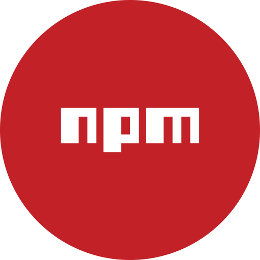
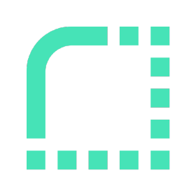
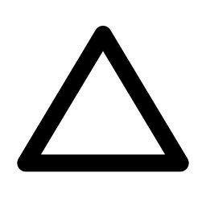

<div align="center">

<a href="https://github.com/BenjaMura"></a>

<a href="https://github.com/BenjaMura"></a>

---

<a href="https://github.com/BenjaMura"></a>

```
👨‍💻 I'm driven by the idea of using my coding skills to create meaningful and impactful solutions. Whether it's developing software that improves efficiency, solving real-world problems, or contributing to projects that make a difference.
```
```
🤝 Being part of a big community where we can learn from others and have a positive impact is something I value and enjoy beyond measure. I believe in the important power of collaboration and the mutual exchange of knowledge.
```
```
💡 Solving complex problems and puzzles gives me a great satisfaction. My logical and analytical thinking allows me to face challenges in a more structured way to find creative solutions. At the same time, I consider it very important to think outside the box to find unique and efficient solutions to problems.
```
```
🚀 The ever-evolving nature of technology fuels my motivation to constantly learn and stay on top of the latest trends and advancements. I wholeheartedly support the concept of lifelong learning and enthusiastically embrace new technologies and frameworks.
```
```
🏃 In my free time I exercise regularly. I find it not only entertaining but also a great way to relax after a long day of programming.
```

<a href="https://github.com/BenjaMura"></a>
<a href="mailto:benjaminmuratore1@gmail.com"></a>
<a href="https://www.linkedin.com/in/benjamín-muratore-8a5928192"></a>
<a href="https://www.facebook.com/benjamin.muratore"></a>
<a href="https://www.instagram.com/benjaminmuratore"></a>
<a href="https://github.com/BenjaMura"></a>

---

<h3> <a href="https://github.com/BenjaMura"></a> &nbsp Skills &nbsp <a href="https://github.com/BenjaMura"> </h3>


<a href="https://developer.mozilla.org/en-US/docs/Web/JavaScript"></a>
<a href="https://developer.mozilla.org/en-US/docs/Web/HTML"></a>
<a href="https://developer.mozilla.org/en-US/docs/Web/CSS"></a>
<a href="https://code.visualstudio.com"></a>
<a href="https://vitejs.dev"></a>
<a href="https://react.dev"></a>
<a href="https://redux.js.org"></a>
<a href="https://nodejs.org"></a>
<a href="https://expressjs.com"></a>
<a href="https://www.npmjs.com"></a>
<a href="https://jestjs.io"></a>
<a href="https://www.postgresql.org"></a>
<a href="https://sequelize.org"></a>
<a href="https://git-scm.com"></a>
<a href="https://www.postman.com"></a>
<a href="https://render.com"></a>
<a href="https://vercel.com"></a>

---

<h3> <a href="https://github.com/BenjaMura"></a> &nbsp Learning &nbsp <a href="https://github.com/BenjaMura"></a> </h3>

<a href="https://www.typescriptlang.org"></a>
<a href="https://nestjs.com/"></a>
<a href="https://nextjs.org/"></a>
<a href="https://tailwindcss.com"></a>
<a href="https://getbootstrap.com"></a>
<a href="https://mochajs.org"></a>
<a href="https://vitest.dev"></a>
<a href="https://www.mongodb.com"></a>
<a href="https://www.netlify.com"></a>
<a href="https://www.figma.com/"></a>

---

<h3> <a href="https://github.com/BenjaMura"></a> &nbsp GitHub Statistics &nbsp <a href="https://github.com/BenjaMura"></a> </h3>


</div>